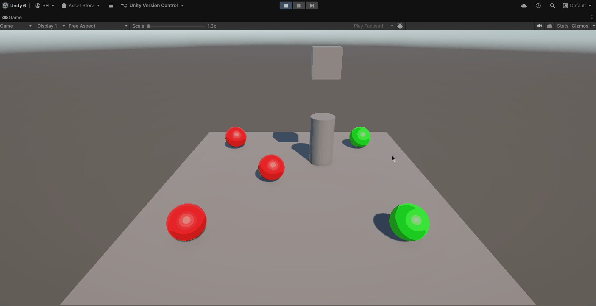
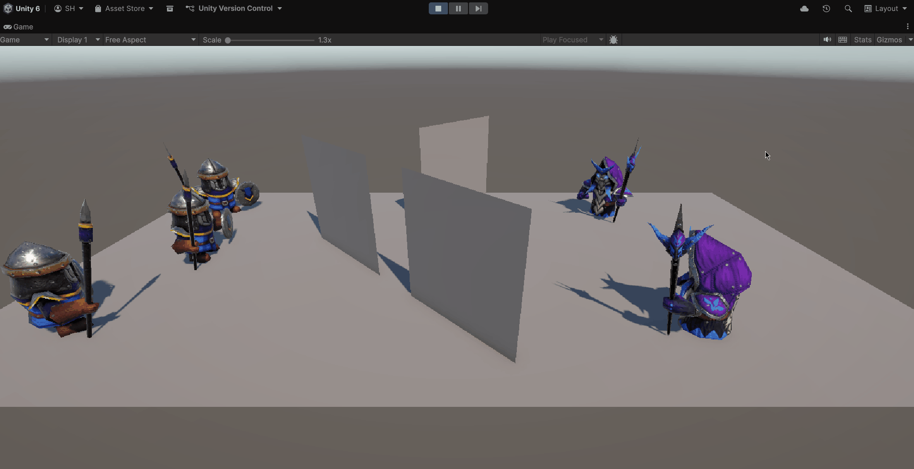
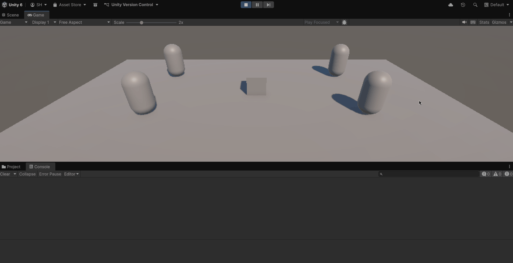
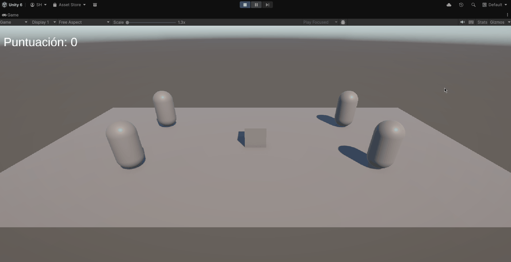

# Práctica 4 - Delegados y Eventos

## Ejercicio 1

Scripts relacionados:

- [CollisionEvents.cs](Assets/Scripts/CollisionEvents.cs)
- [CylinderTrigger.cs](Assets/Scripts/CylinderTrigger.cs)
- [SphereMover.cs](Assets/Scripts/SphereMover.cs)

Escena con 5 esferas (Type1 rojas, Type2 verdes), un cubo y un cilindro. Cuando el cubo colisiona con el cilindro, el cilindro lanza un evento al que están suscritas todas las esferas. Tras recibir el evento: las esferas `Type1` se dirigen hacia una `Type2` fijada previamente; las esferas `Type2` se desplazan hacia el cilindro.

## Ejercicio 2

Scripts relacionados:

- [CollisionEvents.cs](Assets/Scripts/CollisionEvents.cs)
- [CylinderTrigger.cs](Assets/Scripts/CylinderTrigger.cs)
- [SphereMover.cs](Assets/Scripts/SphereMover.cs)

Los objetos geométricos de la escena del ejercicio 1 se sustituyen por personajes humanoides provenientes de los assets _Mini Legion Footman_ y _Mini Legion Lich_. Las esferas (ahora footmen/liches) mantienen la lógica de delegados y eventos: cuando ocurre la colisión del cubo con el cilindro, los humanoides “Type1” caminan hacia un objetivo humanoide “Type2” fijo, y los “Type2” caminan hacia el cilindro.

## Ejercicio 3

Scripts relacionados:

- [CollisionEvents.cs](Assets/Scripts/CollisionEvents.cs)
- [CubeCollision.cs](Assets/Scripts/CubeCollision.cs)
- [SphereMover.cs](Assets/Scripts/SphereMover.cs)

En esta versión se amplía la escena con humanoides de tipo 1 y 2, y escudos de ambos tipos.

- Si el cubo colisiona con un humanoide tipo 2, los del grupo 1 se mueven hacia el escudo tipo 1.
- Si el cubo colisiona con un humanoide tipo 1, los del grupo 2 se mueven hacia los escudos tipo 2.
- Cuando un humanoide toca un escudo, cambia de color mediante el evento `OnTriggerEnter`.

## Ejercicio 4

Scripts relacionados:

- [CollisionEvents.cs](Assets/Scripts/CollisionEvents.cs)
- [CubeProximityDetector.cs](Assets/Scripts/CubeProximityDetector.cs)
- [SphereMover.cs](Assets/Scripts/SphereMover.cs)

En este ejercicio, el cubo detecta su proximidad con un objeto de referencia usando la distancia.  
Cuando se activa:

- Los humanoides del grupo 1 se **teletransportan instantáneamente** a un escudo objetivo.
- Los humanoides del grupo 2 se **orientan hacia** un objeto fijo en la escena.

## Ejercicio 5

Scripts relacionados:

- [ScoreManager.cs](Assets/Scripts/ScoreManager.cs)
- [CollectibleShield.cs](Assets/Scripts/CollectibleShield.cs)
- [CubeCollector.cs](Assets/Scripts/CubeCollector.cs)
- [CubeMovement.cs](Assets/Scripts/CubeMovement.cs)

Se implementa un sistema de puntuación usando colisiones.  
El cubo puede recolectar escudos:

- Escudos tipo 1 → +5 puntos
- Escudos tipo 2 → +10 puntos

## Ejercicio 6

Scripts relacionados:

- [ScoreManager.cs](Assets/Scripts/ScoreManager.cs)
- [ScoreUI.cs](Assets/Scripts/ScoreUI.cs)

Se añade una interfaz de usuario mediante un **Canvas** y un texto **TextMeshPro** que muestra la puntuación actual.

